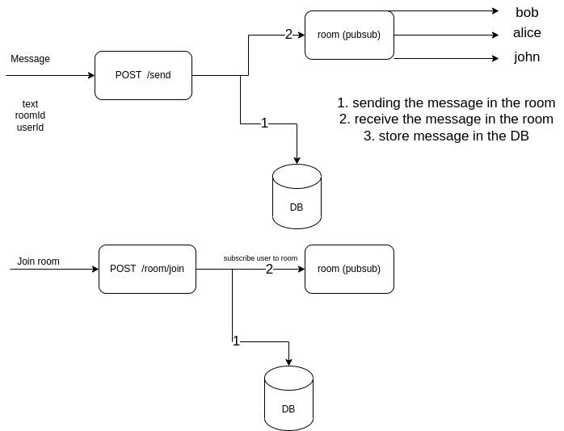

# Functionalities
* Send and receive message 1 to 1
* Authentication

# Flow Diagram

// client <- userId           <- user is online
// hub <- roomId[ []client ]  <- join room

# Table schema
1. Rooms
id --- name --- created_at --- updated_at

2. Users
id --- name --- email --- password --- created_at --- updated_at

3. Subscriptions
id --- roomId --- userId --- created_at --- updated_at

4. Messages
id --- msg --- roomId --- userId --- created_at --- updated_at
